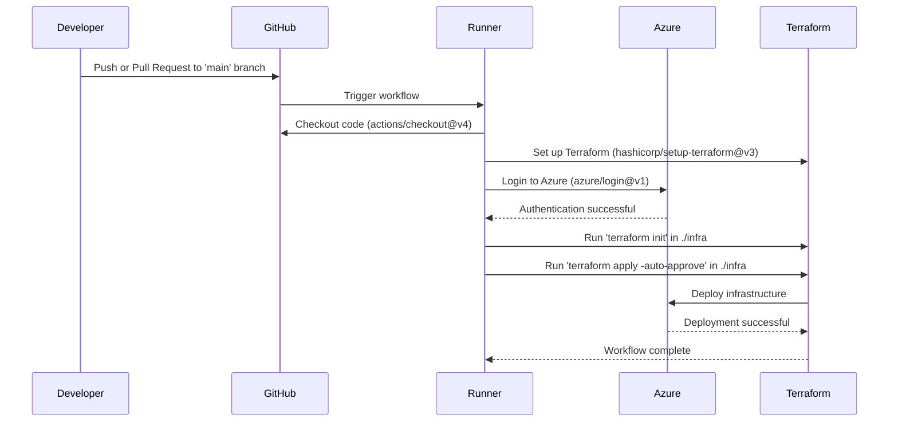

# Explanation of `deploy.yml`

This GitHub Actions workflow automates the deployment of infrastructure to Azure using Terraform.

---

## Workflow Name
- **`Deployment to Azure`**: The name of the workflow.

---

## Triggering Events
- **`push`**: The workflow is triggered when code is pushed to the `main` branch.
- **`pull_request`**: The workflow is also triggered when a pull request is opened or updated targeting the `main` branch.

---

## Job: `terraform`
- **Purpose**: Deploy infrastructure and run tests.
- **Runner**: The job runs on an `ubuntu-latest` virtual machine.

---

## Steps
1. **Checkout Code**:
   - **Action**: `actions/checkout@v4`
   - **Purpose**: Pulls the repository code into the runner for further processing.

2. **Set up Terraform**:
   - **Action**: `hashicorp/setup-terraform@v3`
   - **Purpose**: Installs and configures Terraform on the runner.

3. **Azure Login**:
   - **Action**: `azure/login@v1`
   - **Purpose**: Authenticates with Azure using credentials stored in the `AZURE_CREDENTIALS` secret.

4. **Terraform Init**:
   - **Command**: `terraform init`
   - **Working Directory**: `./infra`
   - **Purpose**: Initializes Terraform by downloading necessary providers and setting up the backend.

5. **Terraform Apply**:
   - **Command**: `terraform apply -auto-approve`
   - **Working Directory**: `./infra`
   - **Environment Variables**:
     - `TF_VAR_username`, `TF_VAR_password`: Terraform variables for authentication.
     - `ARM_CLIENT_ID`, `ARM_CLIENT_SECRET`, `ARM_SUBSCRIPTION_ID`, `ARM_TENANT_ID`: Azure credentials for deploying resources.
   - **Purpose**: Applies the Terraform configuration to deploy infrastructure to Azure.

---

## Outcome
- The workflow securely deploys infrastructure to Azure using Terraform, ensuring an automated and repeatable process.