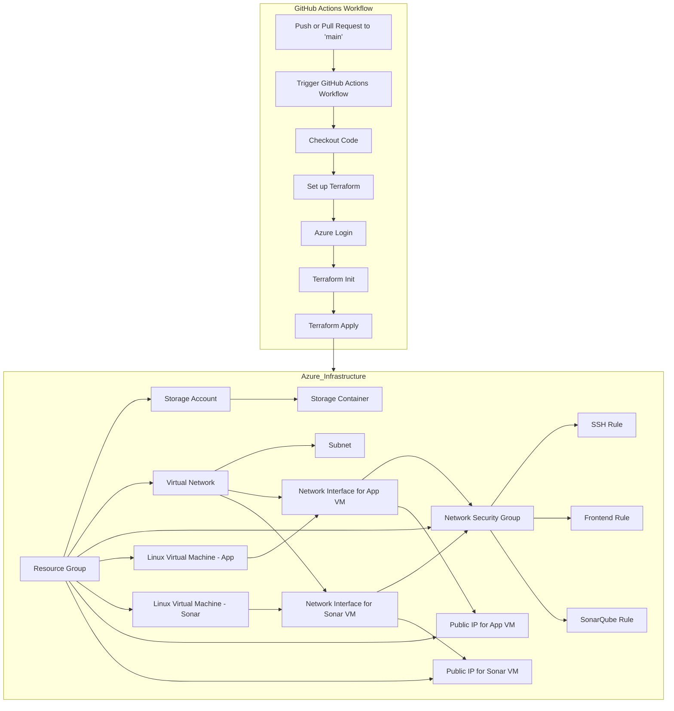

```mermaid
graph TD
    subgraph GitHub Actions Workflow
        A[Push or Pull Request to 'main'] --> B[Trigger GitHub Actions Workflow]
        B --> C[Checkout Code]
        C --> D[Set up Terraform]
        D --> E[Azure Login]
        E --> F[Terraform Init]
        F --> G[Terraform Apply]
    end

    subgraph Azure_Infrastructure
        RG[Resource Group]
        RG --> SA[Storage Account]
        SA --> SC[Storage Container]
        RG --> VNet[Virtual Network]
        VNet --> Subnet[Subnet]
        VNet --> NIC1[Network Interface for App VM]
        VNet --> NIC2[Network Interface for Sonar VM]
        RG --> NSG[Network Security Group]
        NSG --> Rule1[SSH Rule]
        NSG --> Rule2[Frontend Rule]
        NSG --> Rule3[SonarQube Rule]
        NIC1 --> NSG
        NIC2 --> NSG
        RG --> AppVM[Linux Virtual Machine - App]
        RG --> SonarVM[Linux Virtual Machine - Sonar]
        AppVM --> NIC1
        SonarVM --> NIC2
        RG --> PublicIP1[Public IP for App VM]
        RG --> PublicIP2[Public IP for Sonar VM]
        NIC1 --> PublicIP1
        NIC2 --> PublicIP2
    end

    G --> Azure_Infrastructure
```